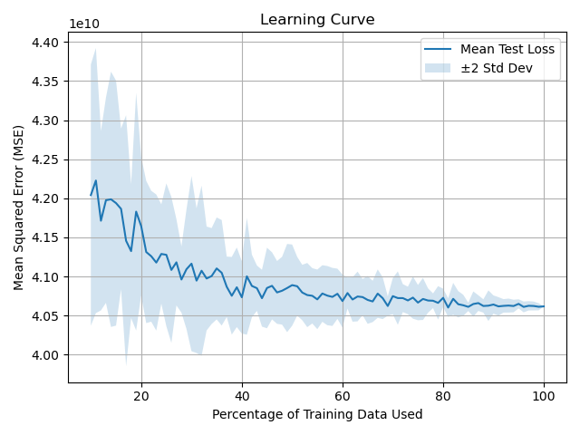
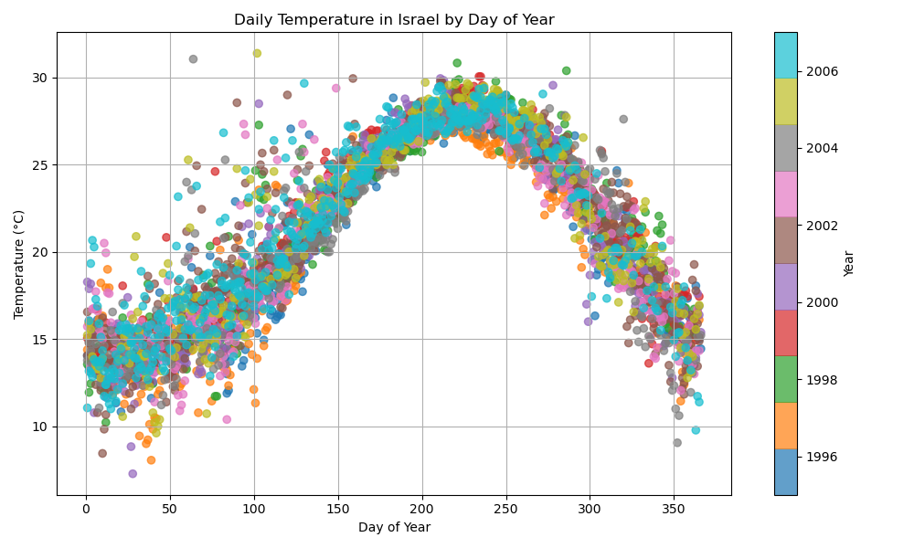
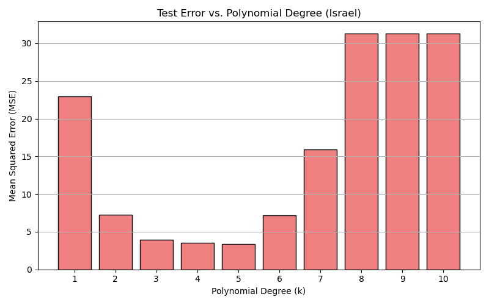
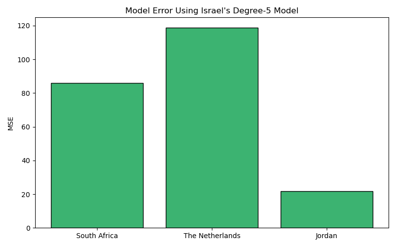

# From-Scratch Regression and Data Analysis in Python

This repository showcases a compact machine learning project built around two classic supervised learning tasks:

- implementing **ordinary least squares linear regression from scratch**
- extending it to **polynomial regression**
- applying both models to **real datasets** with preprocessing, feature engineering, visualization, and error analysis

The project was originally developed as part of an introductory machine learning assignment and then cleaned up into a portfolio-style repository that highlights practical data work, modeling fundamentals, and clear experimentation.


## Project structure

```text
.
|-- linear_regression.py              # OLS regressor solved with pseudo-inverse
|-- polynomial_fitting.py            # Polynomial regression via Vandermonde features
|-- house_price_prediction.py        # Housing-price preprocessing, feature analysis, and learning curve
|-- city_temperature_prediction.py   # Temperature exploration and polynomial model evaluation
|-- house_prices.csv                 # Housing dataset
|-- city_temperature.csv             # Daily temperature dataset
|-- feature_plots/                   # Per-feature correlation visualizations for house prices
|-- learning_curve.png
|-- israel_temp_scatter.png
|-- israel_monthly_std.png
|-- country_monthly_avg_temp.png
|-- polynomial_test_errors_israel.png
|-- israel_model_generalization.png
```

## Technical overview

### 1. Custom linear regression

[`linear_regression.py`](./linear_regression.py) implements ordinary least squares using the Moore-Penrose pseudo-inverse:

- optional intercept term
- `fit`, `predict`, and MSE-based `loss`
- lightweight, readable implementation focused on fundamentals

### 2. Polynomial regression

[`polynomial_fitting.py`](./polynomial_fitting.py) extends the linear model by applying a Vandermonde transformation:

- univariate polynomial expansion up to degree `k`
- reuse of the linear regression implementation through inheritance
- easy comparison of model complexity versus test error

### 3. House price prediction

[`house_price_prediction.py`](./house_price_prediction.py) works on a structured tabular dataset and includes:

- feature selection and cleanup
- filtering invalid or incomplete examples
- engineered predictors such as:
  - `house_age`
  - `was_renovated`
  - `years_since_renovation`
  - `living_to_lot_ratio`
  - `above_ground_ratio`
  - `basement_ratio`
  - `bath_bed_ratio`
- feature-vs-target visualization using Pearson correlation
- train/test split and learning-curve evaluation

### 4. City temperature modeling

[`city_temperature_prediction.py`](./city_temperature_prediction.py) explores seasonal temperature behavior and model transfer:

- data cleaning and calendar-based feature extraction
- exploratory plots for Israel
- cross-country comparison of monthly temperature statistics
- polynomial degree sweep (`k = 1..10`)
- model generalization test from Israel to other countries

## Example outputs

### Housing learning curve



### Israel daily temperatures across the year



### Polynomial degree comparison on Israel



### Transfer performance across countries



## How to run

Install dependencies:

```bash
pip install -r requirements.txt
```

Run the housing-price workflow:

```bash
python house_price_prediction.py
```

Run the temperature workflow:

```bash
python city_temperature_prediction.py
```
